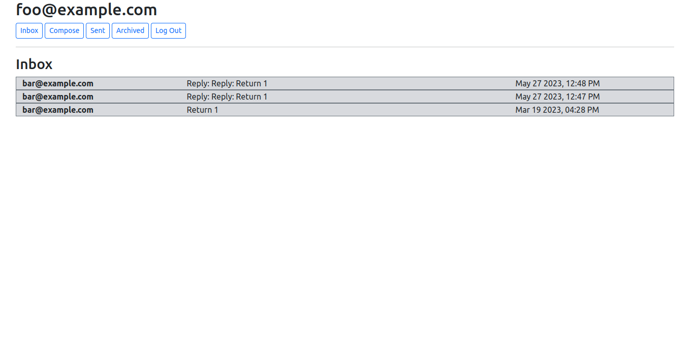

# Email Single Page Application
Design a front-end for an email client that makes API calls to send and receive emails.

## Preview


## Functionalities
- User authentication (login, logout, register)
- Users can compose email
- Users can view their Inbox, Sent mailbox or Archive mailbox
- Users can view single email
- Users can archive or unarchive an email. This function does not apply to Sent email
- Users can reply an Inbox email
- Users can navigate each function as a Single Page
- Via the admin interface, a site administrator can manage users and emails

## Tools
- [Plain JavaScript](https://developer.mozilla.org/en-US/docs/Web/JavaScript)
- [Django](https://docs.djangoproject.com/)
- [Bootstrap](https://getbootstrap.com/)
- [SQLite](https://www.sqlite.org/)

## Run (Local)
```bash
python3 manage.py runserver
```
